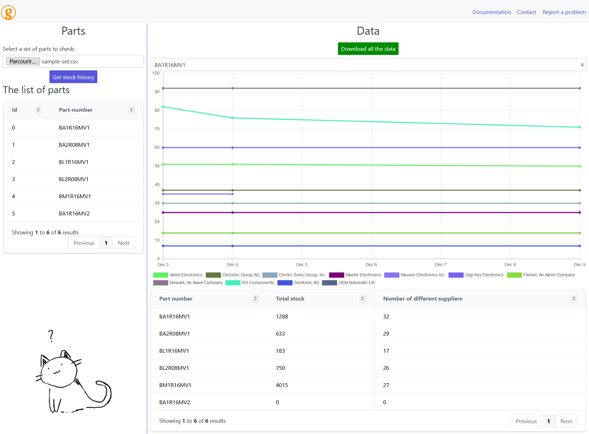

# Back to the future

  

## About this tool

**Back to the future** is a tool designed to record the stock history for a given set of part-number manufactured and sold by Crouzet. The main goal is to create a database recording at regular intervals the stock of each part on each retailer. This data can then be exploited to produce meaningful figures, such as the top 50 most sold parts of the month. Furthermore, tracking the evolution of the stock enables Crouzet to be proactive and to contact retailers to offer them to renew their stock before they run out of stock.

The main tool is a web interface written in TypeScript that allows the user to query the database. It displays nice graphs that represent the stock evolution throughout the time and a (buggy, see issue #36) summary of the stock and retailers for each part-number. It allows the user to export the data to an excel file for further exploitation.

## About Crouzet

_shamelessly copy-pasted from crouzet.com_

Crouzet is an independent company manufacturing electromechanical and electronic components for demanding applications in Aerospace & Transportation, Energy, Building and Machinery Industry. ​
Crouzet provides Switches and Sensors, Electromechanical Actuators, Electrical Protection equipment, Cockpit Controls, Automation Controllers and Relays, and Instrumentation Services.​
Since 1921, Crouzet has a heritage of close collaboration with customers in the development of products, from standard components to fully customized solutions.​ Crouzet’s customers and partners can rely on our teams worldwide to always meet and often exceed their expectations. Driven by innovation, our experts are focused on designing and delivering the right product for the right application.​
Crouzet is your trusted partner of choice to face the industrial challenges of today and tomorrow.​

## Documentation

The documentation of the project can be found in the [/docs folder](https://gitlab.com/gaspacchio/back-to-the-future/-/tree/main/docs) of this repo.
