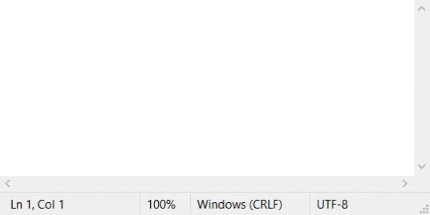

# Documentation

The documentation for this tool is organized in subfolders. You will find user-specific documentation, how-to deploy, and technical documentation.

## User-specific documentation

_Head to the [/getting-started](./getting-started/) folder for more details_

The principal tool is a web interface. It is accessible on desktop and on smartphone and should be really easy to use.

### Basic usage

First, you need to select a `.csv` file. The file will be processed, and the graph will update accordingly. The chart displays the stock of a part-number for a retailer on each day it was updated. You can change the part-number you're viewing via the dropdown selector on top of the graph. If you hover over the dots, you will see the detailed stock for this day and retailer. Finally, if you click on a retailer name, you can hide it from the graph.

### What is a CSV file, and how can I create one?

A comma-separated values (CSV) file is a delimited text file that uses a comma to separate values. Each line of the file is a data record. Each record consists of one or more fields, separated by commas. The use of the comma as a field separator is the source of the name for this file format. A CSV file typically stores tabular data (numbers and text) in plain text, in which case each line will have the same number of fields. _[From Wikipedia, the free encyclopedia](https://en.wikipedia.org/wiki/Comma-separated_values)_

If you are working on an Excel file, you can easily export a list of part-numbers to a CSV file (see the [Microsoft docs](https://support.microsoft.com/en-us/office/import-or-export-text-txt-or-csv-files-5250ac4c-663c-47ce-937b-339e391393ba) for some help on how to do it). You can also create a CSV file by hand: simply create a new text file (using Notepad) and type in all the part numbers, each one on a separate line, as shown below.

## How-to deploy and update

_To deploy, read [how-to-deploy.md](./how-to-deploy.md)_

_To update read [how-to-update.md](./how-to-update.md)_

## Technical specifications, code documentation, API specification architecture schemes...

_You'll find these in the [/specifications](./specifications/) folder_
