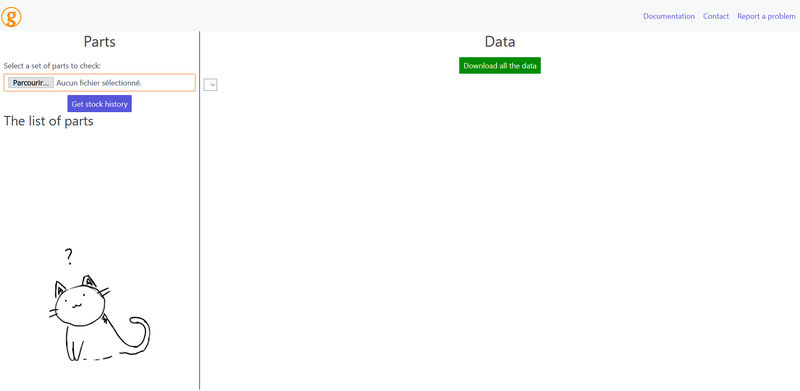
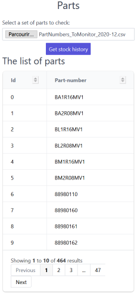
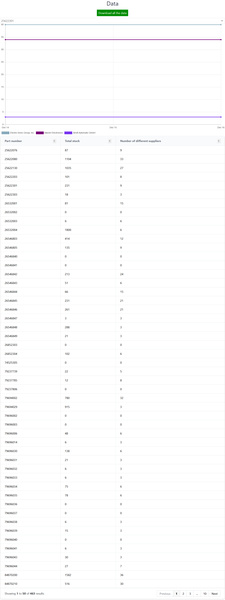

# Getting started

- [Getting started](#getting-started)
  - [A first approach to the interface](#a-first-approach-to-the-interface)
    - [The file upload section](#the-file-upload-section)
    - [The data section](#the-data-section)
      - [Using the chart](#using-the-chart)

## A first approach to the interface

The web interface is divided into two main sections: the left side is used to submit a list of parts and the right side to browse through the results. We will quickly inspect each section before giving you a quick tour of the most common operations.

### The file upload section

_This section is dedicated to uploading and reviewing the content of a CSV file containing a set of parts._

You should click on the "Browse" button to open a valid CSV file. The app will then read the file and try to get the historical stock data for each part automatically.

If the file is valid, you will see a summary of the part numbers you provided like in the illustration below:

You will get the number of part numbers in your file (464 in this example) and you can browse through the full part list. Duplicates are removed.

### The data section

_In this section, you will find a chart and a table summary of all the stock records found for your set of parts_

Here, you get to review the stock history found for each part number provided. The two main tools of this section are the chart and the table summary. You will also be able to download all the stock information as an Excel file thanks to the "Download all the data" button.

#### Using the chart
