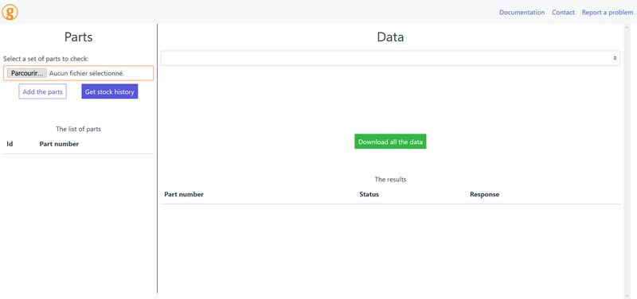
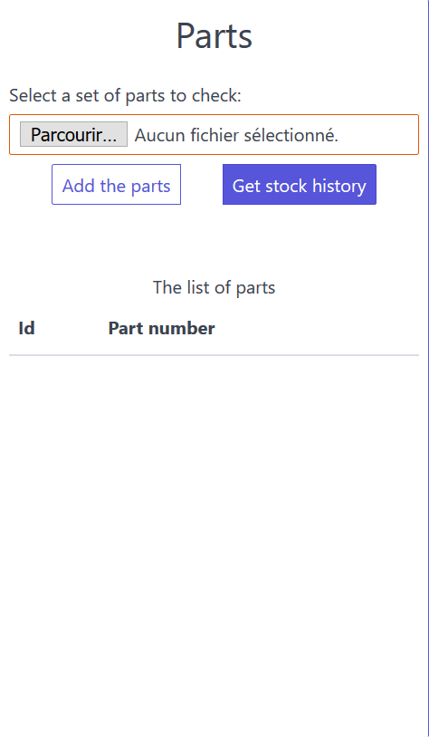
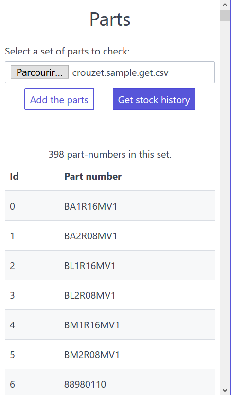
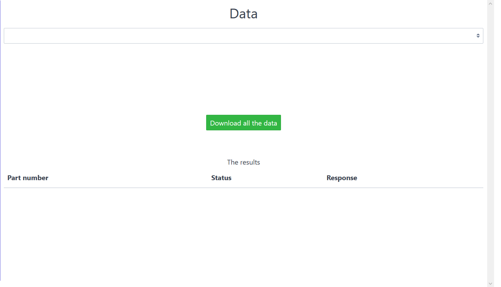

> The web interface.

## Table of contents

- [Table of contents](#table-of-contents)
- [The interface](#the-interface)
  - [The navigation bar](#the-navigation-bar)
  - [The file upload section](#the-file-upload-section)
  - [The data section](#the-data-section)

## The interface

The web interface is divided in three main sections. We will quickly inspect each section before giving you a quick tour of the most common operations.

### The navigation bar

The navigation bar is at the top of the screen and contains clickable links to go to **the homepage**, go to the **documentation**, **send an email** to the developer of the project and finally send an email to **report a problem**.

### The file upload section

This section is dedicated to uploading and reviewing the content of a CSV file containing a set of parts (see [What is a CSV file and how to generate one?](../basics-csv/)). You can click on the "Browse" button or the purple "Get stock" button to open a valid CSV file. The app will then read the content of the file and try to get the historical stock data for each part automatically.

If the file is valid, you will see a summary of the part numbers you provided like in the illustration below.

You will get the total number of part number in your file (398 in this example) and you can scroll the full part list. Duplicates are removed before processing.

### The data section

[//]: # 'TODO: insert the URL'
